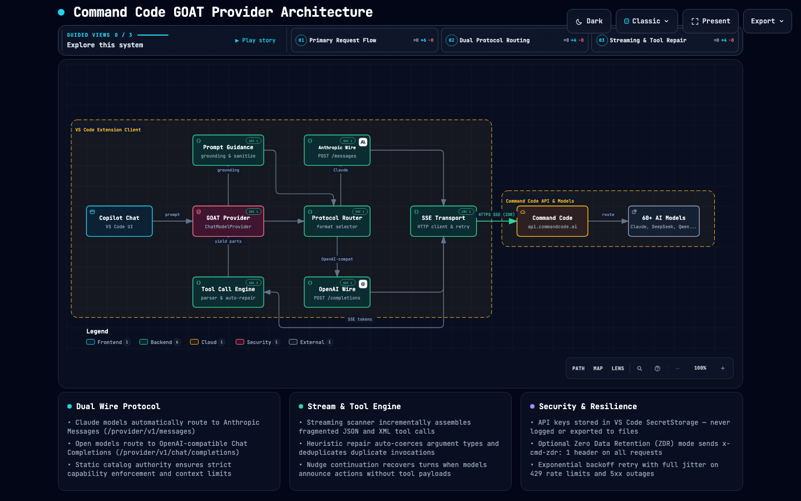

# Command Code GOAT Provider

[](LICENSE)

Command Code GOAT Chat Provider for GitHub Copilot in Visual Studio Code. Access 60+ AI models directly from the Copilot Chat model picker with streaming responses, tool calling, image understanding, and thinking/reasoning inspection.

---

## Features

- **60+ AI Models**: Full support for Claude 5 / 4.6 / 4.8 / 4.7 / Haiku 4.5, DeepSeek V4 Pro / Flash, Kimi K3 / K2.7 / K2.6, GLM-5.3 / 5.2, MiniMax M3, Qwen 3.8 / 3.7, Gemini 3.7 / 3.6 / 3.5, Grok 4.6 / 4.5, Muse Spark, and more.
- **Dual Protocol Routing**: Automatically routes Claude models to the Anthropic Messages API (`/provider/v1/messages`) and other models to OpenAI-compatible Chat Completions (`/provider/v1/chat/completions`).
- **Zero Data Retention (ZDR)**: Optional configuration (`commandcode-goat.enableZdr`) to send `x-cmd-zdr: 1` header for strict compliance and privacy requirements.
- **Native Tool Calling & Thinking**: Assembles fragmented streaming tool calls in real time and renders model reasoning blocks in Copilot Chat.
- **Secure Key Storage**: API keys are securely stored in VS Code's `SecretStorage` (`commandcode-goat.apiKey`) and never written to workspace files or logs.
- **Resilient Streaming**: Automatic silent retries for empty or truncated responses and normalized error handling for rate limits, token ceilings, and authorization issues.

---

## Requirements

- **VS Code**: `1.104.0` or higher
- **GitHub Copilot**: Installed and active in VS Code
- **Command Code API Key**: From [Command Code](https://commandcode.ai)

---

## Setup & Configuration

### 1. Configure Your API Key

You can configure your API key in any of the following ways:

1. Open the Command Palette (`Ctrl+Shift+P` / `Cmd+Shift+P`), run **Command Code GOAT: Manage API Key**, and paste your API key.
2. Select any Command Code GOAT model in the Copilot Chat model picker; VS Code will prompt you for the API key if none is stored.

### 2. Optional Settings

In VS Code Settings (`Ctrl+,` / `Cmd+,`), search for `Command Code GOAT`:

- `commandcode-goat.enableZdr` (boolean, default: `false`): Enable Command Code Zero Data Retention mode (`x-cmd-zdr: 1`).

### 3. Commands

- **Command Code GOAT: Manage API Key** (`commandcode-goat.manage`): Set, update, or clear your stored API key.
- **Command Code GOAT: Toggle Debug Logging** (`commandcode-goat.toggleDebugLogging`): Enable or disable verbose debug logs in the output channel.
- **Command Code GOAT: Open Debug Log** (`commandcode-goat.openDebugLog`): Open the Command Code GOAT output channel.

---

## Architecture

[](https://hidenobunagai.github.io/commandcode-goat-provider/)

> 🌐 **[View Interactive Architecture Diagram (GitHub Pages)](https://hidenobunagai.github.io/commandcode-goat-provider/)** — Explore guided flows, dual-protocol routing, and streaming tool repairs in an interactive SVG diagram.

---

## Model Catalog & Protocols

The provider dynamically discovers available models from `GET https://api.commandcode.ai/provider/v1/models` while maintaining static capability authority:

| Model Family | Examples | Wire Protocol | Thinking / Reasoning | Vision |
|---|---|---|---|---|
| **Anthropic Claude** | `claude-sonnet-5`, `claude-sonnet-4-6`, `claude-opus-5`, `claude-haiku-4-5-20251001` | Anthropic `/messages` | Automatic | Supported |
| **DeepSeek** | `deepseek/deepseek-v4-pro`, `deepseek/deepseek-v4-flash`, `deepseek/deepseek-v4-flash-vision-exp` | OpenAI `/chat/completions` | Configurable effort | Supported on Vision |
| **Moonshot Kimi** | `moonshotai/Kimi-K3`, `moonshotai/Kimi-K2.7-Code`, `moonshotai/Kimi-K2.6` | OpenAI `/chat/completions` | Configurable effort | Supported |
| **Zhipu GLM** | `z-ai/glm-5.3-flash`, `zai-org/GLM-5.3`, `zai-org/GLM-5.2` | OpenAI `/chat/completions` | Configurable effort | Text & Tools |
| **MiniMax** | `MiniMaxAI/MiniMax-M3`, `MiniMaxAI/MiniMax-M2.7`, `MiniMaxAI/MiniMax-M2.5` | OpenAI `/chat/completions` | Provider default | Supported (M3) |
| **Alibaba Qwen** | `Qwen/Qwen3.8-Max`, `Qwen/Qwen3.8-27B`, `Qwen/Qwen3.7-Max`, `Qwen/Qwen3.7-Plus` | OpenAI `/chat/completions` | Configurable effort | Supported |
| **Google Gemini** | `google/gemini-3.7-flash`, `google/gemini-3.6-flash`, `google/gemini-3.5-flash` | OpenAI `/chat/completions` | Provider default | Supported |
| **xAI Grok** | `xai/grok-4.6`, `xai/grok-4.5` | OpenAI `/chat/completions` | Configurable effort | Supported |
| **Meta Muse** | `meta/muse-spark-1.2`, `meta/muse-spark-1.2-contributor` | OpenAI `/chat/completions` | Configurable effort | Supported |
| **Other Partners** | `stepfun/Step-3.7-Flash`, `tencent/hy4-preview`, `sakana/fugu-ultra`, `nvidia/nemotron-3-ultra-550b-a55b` | OpenAI `/chat/completions` | Varied | Varied |

---

## Troubleshooting & Error Handling

- **401 / 403 Unauthorized**: Your API key is missing or invalid. Use `Command Code GOAT: Manage API Key` to update it.
- **422 Unprocessable Entity (ZDR mode)**: The selected model or account tier does not support Zero Data Retention. Toggle `commandcode-goat.enableZdr` to `false` in settings.
- **429 Rate Limit**: The provider rate limit has been exceeded. The extension retries with exponential backoff before surfacing errors.
- **400 Token Limit Exceeded**: The conversation length exceeds the model's effective context limit. Reduce conversation history or switch to a 1M-token model.
- **5xx Server Errors**: Temporary provider outage. The extension automatically retries transient server errors up to 5 times.

---

## Development

```bash
# Install dependencies with Bun
bun install --ignore-scripts

# Compile TypeScript
bun run compile

# Run full test suite
bun run test -- --runInBand

# Lint and check formatting
bun run lint
bun run format

# Build VSIX package
bun run package:vsix
```

---

## License

MIT © [Hidenobu Nagai](https://github.com/hidenobunagai)
