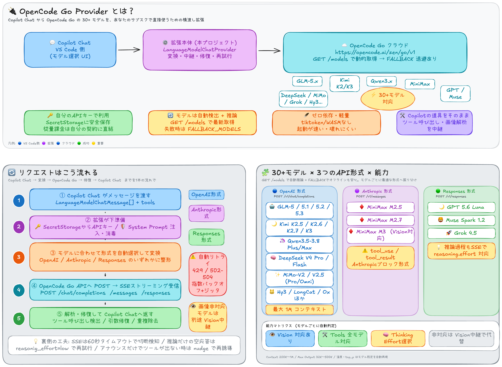

# Command Code GOAT Provider

VS Code extension to use Command Code GOAT models in Copilot Chat.



> **概要**: Copilot Chat から OpenCode Go の 30+ モデルを、あなたのサブスクで直接使うための橋渡し拡張。メッセージを OpenAI / Anthropic / Responses の適切な形式に自動変換し、ツール呼び出しや画像解析も中継します。

## Requirements

- VS Code 1.104.0 or later
- GitHub Copilot extension installed and active
- Command Code GOAT credentials (detailed setup will be added in Task 7)

## Installation

### From Source

1. Clone this repository.
2. Run `bun install --ignore-scripts && bun run compile`.
3. Press `F5` in VS Code to launch the Extension Development Host.

### From VSIX

1. Run `bun install --ignore-scripts && bun run package:vsix`.
2. Install the generated `.vsix` file via the Extensions view (`Install from VSIX...`).

## Setup

Detailed Command Code GOAT setup will be added in Task 7.

## Supported Models

At runtime the extension fetches the current model list from the OpenCode Go API (`GET /models`) and infers each model's capabilities automatically, so newly released models usually work without an extension update. A bundled `FALLBACK_MODELS` list (in `src/types.ts`) is used when the API cannot be reached or no API key is configured yet. Currently bundled fallback models include:

- GLM-5, GLM-5.1, **GLM-5.2**, **GLM-5.3**
- DeepSeek V4 Pro, DeepSeek V4 Flash
- Kimi K2.5, Kimi K2.6, Kimi K2.7 Code, **Kimi K3**
- MiMo-V2-Pro, MiMo-V2-Omni, MiMo-V2.5-Pro, MiMo-V2.5
- MiniMax M2.5, MiniMax M2.7, **MiniMax M3**
- Qwen3.5 Plus, Qwen3.6 Plus, Qwen3.7 Plus, **Qwen3.7 Max**, **Qwen3.8 Max**
- **Grok 4.5**
- **GPT 5.6 Luna**
- **Muse Spark 1.2 Contributor**
- **Hy3**, HY3 Preview

## Usage

1. Open Copilot Chat (`Cmd/Ctrl + Alt + I`).
2. Select **Command Code GOAT** from the provider selector.
3. Choose a model (e.g., Kimi K2.6) and start chatting.

Your Command Code GOAT usage is shown in the VS Code status bar and refreshes after every chat response.

## Documentation

- [Architecture](docs/architecture.md) — Module map, data flow, API formats, and design decisions
- [Contributing](docs/contributing.md) — Development setup, code style, adding models, and debugging
- [Supported Models](docs/models.md) — Full model list, capabilities, and context window details

## Development

```bash
bun install --ignore-scripts
bun run compile
bun run lint
bun run test -- --runInBand
```

Press `F5` in VS Code to launch the Extension Development Host.

### Available Scripts

- `bun run compile` – Compile TypeScript
- `bun run watch` – Compile with file watching
- `bun run test` – Run tests
- `bun run lint` – Lint check with ESLint
- `bun run lint:fix` – Auto-fix with ESLint
- `bun run format` – Format with Prettier
- `bun run package:vsix` – Create VSIX package

## Marketplace Packaging

```bash
bun run package:vsix
```

The command above produces a `.vsix` that can be uploaded in the VS Code Marketplace publisher portal.

## Privacy

- Your API key is stored securely in VS Code and synced with the extension's SecretStorage compatibility path when needed.
- Chat requests are sent to `https://opencode.ai/zen/go/v1`.
